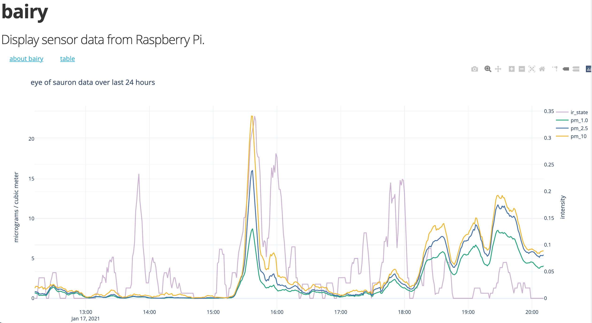
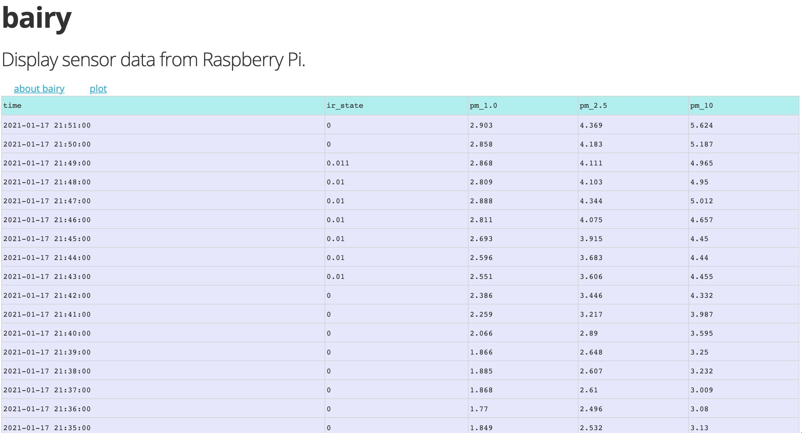
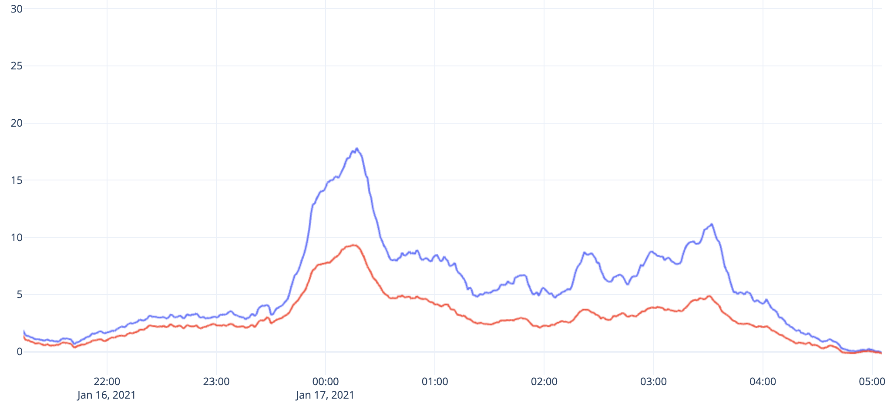

# bairy

> Display data from Raspberry Pi.

Suppose you have a Raspberry Pi IoT-style device that measures and records data. `bairy` provides a framework to share the data across a local network. `bairy` also has the ability to combine, centralize, and display results from multiple devices.

|    |
| :------------------------------------: |
| _A screenshot of the `bairy` web app._ |

## Install

This package requires at least Python 3.7. The following instructions work for Raspbian 10 running on a Raspberry Pi 3 B+.

1. Install the dependencies for the `numpy`-`pandas`-`scipy` suite.

   ```sh
   sudo apt update
   sudo apt install libatlas-base-dev
   ```

1. Install `bairy` with `pip3 install bairy`. If `pip3` is not recognized, try `python3 -m pip install bairy`.

1. Try out `bairy` with random configurations.

   ```sh
   # initialize bairy with sensors providing random readings
   bairy --set-random-configs
   # run the app
   bairy
   ```

1. Point your web browser to `localhost:8000/status`. The _sensor readings_ (a random walk) update every second. Refresh your browser to get the latest reading. Try other [endpoints](#app-endpoints) as well.

1. To stop `bairy`, go back to your terminal and press CTRL + C. Simply run `bairy` again to continue recording and displaying.

1. To remove stored data and configurations, run `bairy --remove all`. Run `bairy --help` to see other command line options.

## Details

### Configuration

Once your Raspberry Pi is equipped with sensors, `bairy` must be configured to be made aware of those sensors. Run `bairy --configs-template` to create a file named `template_configs.json` which can be edited to include details about your sensors. After modifying the template, add the configurations to `bairy` with `bairy --set-configs template_configs.json`. Now run `bairy` to capture sensor readings.

### App endpoints

When `bairy` is initialized, several distinct processes start. Through an asynchronous event loop, `bairy` reads the values of the sensors at specified time intervals and writes them to a `data.csv` file. Concurrently, `bairy` serves a `FastAPI`-backed web app with which the user can interact. This web app can be accessed on the Raspberry Pi itself through at least one of `127.0.0.1:8000` or `0.0.0.0:8000` or `localhost:8000`.

The app includes various endpoints, described below. To navigate to the endpoint `/logs`, point your browser to `localhost:8000/logs`.

- `/docs` Shows endpoint schemas and API documentation.
- `/data` Returns a streaming response of the `data.csv` file.
- `/logs` Returns the `bairy` logs as plaintext.
- `/status` Displays a json object showing active configurations and device status. See the json example below.
- `/remote/update` Update the `bairy` software with `pip`. Requires the Raspberry Pi does not prompt for `sudo` password, which is the default setting.
- `/remote/reboot` Reboot the Raspberry Pi. See [run at startup](#run-at-startup) to ensure `bairy` restarts.
- `/remote/disk` Display disk usage statistics by calling `df -h`.
- `/table` Renders a Dash table showing resampled data. The resampling window depends the overall size of the `data.csv` file. Raw data should be obtained through the `/data` endpoint.
- `/plot` Renders an interactive Dash plot showing resampled data.

As an example, the json response of a `/status` endpoint appears below.

```json
{
  "device_configs": {
    "name": "eye of sauron",
    "sensors": [
      {
        "sensor_type": "air",
        "i2c_address": 18
      },
      {
        "sensor_type": "digital",
        "bcm_pin": 17,
        "header": "ir_state"
      }
    ],
    "update_interval": 1
  },
  "data_details": {
    "file_size": "1.44 MiB",
    "n_rows": 33994
  },
  "latest_reading": {
    "time": "2021-01-17 21:46:40",
    "pm_1.0": 3,
    "pm_2.5": 5,
    "pm_10": 5,
    "ir_state": 1
  }
}
```

### LAN access

The web app can be accessed on the LAN. When `bairy` is run in the command line, it will print its local IP address. This IP address might take the form `192.168.0.17`. To access the `bairy` web app on a different machine on the network, navigate to `192.168.0.17:8000/status`. Here `/status` can be replaced with any of the endpoints above.

### Run at startup

To enable `bairy` to launch as the Raspberry Pi boots, follow the steps below. This is especially useful in _headless_ mode, that is, when the Raspberry Pi is not attached to a monitor. See the [official documentation](https://www.raspberrypi.org/documentation/linux/usage/systemd.md) for more information on working with `systemd` on Raspberry Pi.

1. Run `bairy --create-service` to put a `bairy.service` file in the `/etc/systemd/system` directory.

1. Run `sudo systemctl start bairy.service` to check if the service works.

1. Run `sudo systemctl stop bairy.service` to stop the service. When you restart the Raspberry Pi, `bairy` should automatically start in the background. You can run `ps -aux | grep bairy` to verify `bairy` is working.

## A central hub

If you have several Raspberry Pis simultaneously collecting and sharing data, `bairy` allows you to merge and share the data through a common web app. This central hub can be run on one of the Raspberry Pis, or on an independent device that is not capturing sensor data.

1. You will need to the know the IP addresses of the Raspberry Pi devices which are capturing data with `bairy`. Create a simple text file with these IP addresses. If the hub host is also acting as a sensing device, include the word `self` in this file.

   ```txt
   192.168.0.17
   192.168.0.34
   self
   ```

1. Register these IP addresses with `bairy`. If the file is named `ip.txt`, run the command below.

   ```sh
   bairy hub --set-configs ip.txt
   ```

1. Now run `bairy hub` to launch the hub web app. Data is periodically requested from devices (every hour), then merged into a single `plotly` plot. Point your browser to `localhost:8000` to view the app. Use the `/docs` endpoint to view other available endpoints.

1. Run `bairy hub --service` to create a startup service to run the hub. This will override any previously created device service.

|                          |
| :----------------------------------------------------------: |
|                          |
| _More screenshots of the `dash` portion of the `bairy` app._ |

## License

[MIT License](LICENSE.md)
